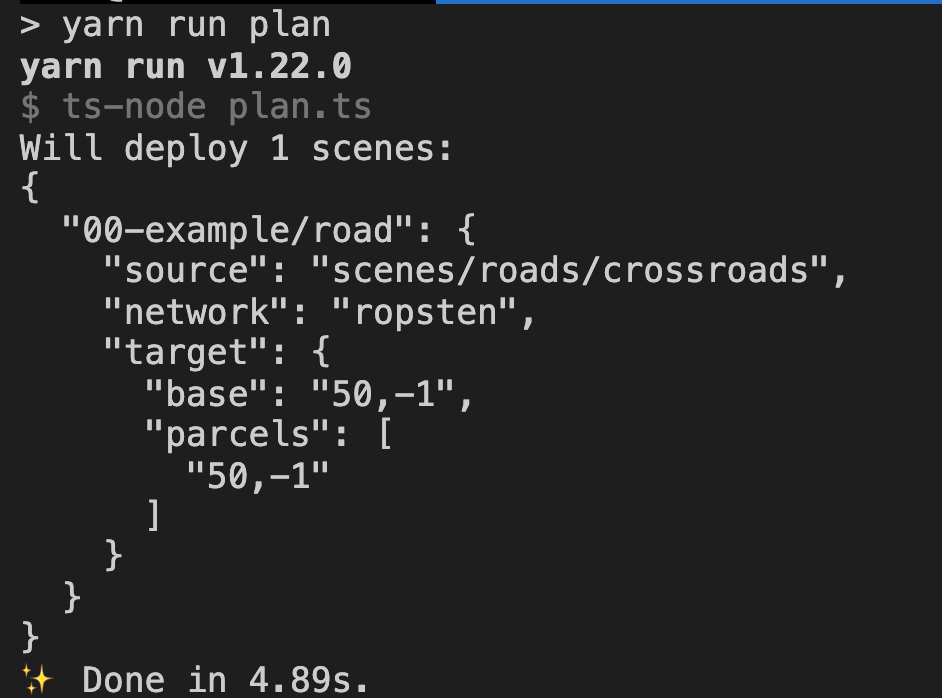

# decentraform

Automatically deploy scenes to Decentraland using git

## Motivation

For a large land owner, it might be difficult to keep track of which scenes should be deployed where. Additionally, a district or an organization might have multiple users trying to deploy. This project is an attempt at optimizing the process to deploy scenes for such users.

## Usage 

This repository uses CircleCI to automatically update scenes on Decentraland. It has three main systems:

* Configuration: map which private key to use to deploy each parcel
* Scenes: used to organize the latest versions of the pool of scenes to be deployed
* Planning: a step comparing the desired state of the deployments vs the actual current deployments on a content server
* Deploy: execution of the plan to deploy

## Configuration

*Warning*: Dealing with secrets is dangerous. Make sure you don't hold private keys on your systems (not even temporarily) more than you need. Avoid saving such keys to disk, specially unencrypted. Avoid storing them on your clipboard or any temporary medium that might be watched by processes on the system. Always prefer to use the least amount of privileges, both regarding the permissions of the user or active account, as well as leveraging things like UpdateOperators on LAND and Estate tokens.

The folder `config` contains these files and folders:

* addresses.json: maps `x,y` coordinates to the address to use for deployment
* keys: a folder to be filled with files that use the Ethereum encrypted private key file format 

    The deployment phase expects to find the encryption key to open the files on the `keys` folder in an environment variable with the prefix `UNLOCK_` and the ethereum address, with checksum casing, as the suffix.

## Scenes

The folder `scenes` is where the working copy of all scenes created shall be placed. The intended use of this is to freely download builder scenes in here.

## Planning

### User Instructions

Fill in `deploy.json` files on subfolders on the the `deploys` folder. It's recommended to use the `XX-name` convention to organize these files, so as to mark the order in which potentially conflicting rules will be prioritized. Use cases include overriding a deployment temporarily by creating a more prioritary deploy and then delete that file, or overriding a template-based road deployment with a custom one. For example, a folder named `01-roads-automated` might include the automatically generated deployment for a road on `10,10`, but then a folder named `10-road-override` might override that with a scene created with the builder that sports a sign with a name.

```
deploys
├── 00-genesis-plaza
│   └── deploy.json
├── 01-roads-automated
│   └── deploy.json
├── 02-road-override
│   ├── 00-road.-10.10
│   │   └── deploy.json
│   └── no-need-to-prioritize-folders.-100.23
│       └── deploy.json
├── 10-vegas-plaza
│   └── deploy.json
├── 20-this-will-override-vegas
│   └── deploy.json
└── voltaire-district-foldernames-can-start-with-anything
    └── deploy.json
```

### Execution: `yarn run plan`

- Generation of `targets`

The folder `targets` is created, overriding the values on `scene.json` files to match the information (issuing warnings in the process). These `targets` will follow the same folder structure as the `deploys` folder, but instead of only having `deploys.json` files, it would have the whole source code required for building the scenes.

- Validation & Comparison

All the scenes on the `targets` folder are checked against the deployed scenes. A list of deploy targets is crafted, with the folders that would need to be deployed in a file named `plan.json`.



## Deployment: `yarn run deploy`

This will:

- Read the `plan.json` file
- Execute the deployments

# License

This code is available under the Apache-2.0 open source license.
